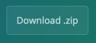

**Où:** Salles TD5.127 et TD5.130 

**Quand:** Du 10 octobre 2024 au 12 décembre 2024

**Instructeurs:** 
[Sandra Cortijo](mailto:sandra.cortijo@cnrs.fr), 
[Charlotte Lecuyer](mailto:charlotte.lecuyer@cnrs.fr)

## Description

Ce cours va vous apprendre comment explorer des données et réaliser des graphiques dans **R**. 

Afin de pouvoir faire ce cours sur votre ordinateur, téléchargez le matériel du cours en cliquant sur  et dézippez le dossier téléchargé. Ce dossier contient les données ainsi que le matériel vous permettant de mettre en pratique le cours et de faire les exercices.

Les différentes séances sont (avec accès au cours):

### Séance 1 (Lundi 07/10/2024 13h15-14h45, salle TD5.130): Organisation des données 

[Matériel organisation des données](session1_organisation/materiel/organisation_session.html)  

[Solution des exercices](session1_organisation/materiel/organisation_session_solution_exercices.html)

 

### Séance 2 (Jeudi 10/10/2024 13h15-16h30, salle TD5.130): Intro à **R** et réaliser des graphiques (partie 1)

[Matériel intro à R](session2_intro_ggplot/materiel/intro_R.html)  

[Solution des exercices](session2_intro_ggplot/materiel/intro_R_solution_exercices)

 

[Matériel réaliser des graphiques](session2_intro_ggplot/materiel/ggplot_session.html)  

[Solution des exercices](session2_intro_ggplot/materiel/ggplot_exercise_solutions.html)

 

### Séance 3 (Vendredi 18/10/2024 13h15-16h30, salle TD5.127): Réaliser des graphiques (partie 2) et ajout des résultats de tests statistiques

[Matériel réaliser des graphiques](session3_plots_stats/materiel/ggplot_session.html)  

[Solution des exercices](session3_plots_stats/materiel/ggplot_exercise_solutions.html)

 

[Matériel ajouter des résultats de tests statistiques à des graphiques](session3_plots_stats/materiel/statistiques.html)  

[Solution des exercices](session3_plots_stats/materiel/statistiques_solution_exercices.html)  

 

### Séance 4 (Jeudi 24/10/2024 13h15-16h30, salle TD5.130): Réorganisation de données 

[Partie 2 - Matériel réorganisation de données](session4_reorganisation/materiel/reorganisation_donnees.html)  

[Solution des exercices](session4_reorganisation/materiel/reorganisation_donnees_solution_exercices.html)

 

### Séance 5 (Lundi 04/11/2024 13h15-16h30, salle TD5.130): Réorganisation de données avancées

[Matériel réorganisation avancée de données ](session5_reorganisation_avancee/materiel/reorganisation_avancee.html)  

[Solution des exercices](session5_reorganisation_avancee/materiel/reorganisation_avancee_solution_exercices.html)

 

###    Attention, la séance du 15 novembre est déplacée au 20 novembre ! 

### Séance 6 (Lundi 18/11/2024 13h15-16h30, salle TD5.130): Réorganisation avancée de données (suite)  ET utilisation d'outils d'IA pour l'aide au codage

[Matériel réorganisation de données avancée (suite)](session6_reorganisation_suite_IA/materiel/reorganisation_avancee_suite.html) 

[Solution des exercices](session6_reorganisation_suite_IA/materiel/reorganisation_avancee_suite_solution_exercices.html)

 

[Matériel utilisation d'outils d'IA pour l'aide au codage](session6_reorganisation_suite_IA/materiel/aide_IA_codage.html) 

 

### Séance 7 (Mercredi 20/11/2024 13h15-16h30,  Bibliothèque à l'IPSiM  ): Exam blanc, Correction de l'exam blanc et trucs et astuces

### Séance 8 (Jeudi 12/12/2024 9h45-11h15, salle TD5.130): Exam

 

### BONUS

[Créer un Rmarkdown](Rmarkdown/materiel/rmarkdown_session.html) 

[Solution des exercices - Créer un Rmarkdown](Rmarkdown/materiel/Solution.html)

 

### Liens  utiles

[Antisèches](https://www.rstudio.com/resources/cheatsheets/)

[Liste de liens utiles et trucs & astuces](astuces.html)

 

## Modalités d'évaluation

**L'évaluation de cette matière va comporter:**

**1. Un contrôle continu qui combine les exercices à faire entre les séances sur votre ordinateur personnel. Une première moitié du contrôle continu sera à déposer sur Moodle au plus tard le  03/11/2024 à minuit. La deuxième moitié sera à déposer sur Moodle au plus tard le 01/12/2024 à minuit.**

**2. Un devoir en classe lors de la dernière séance le 12/12/2024**

 

## Pour utiliser R chez vous: 
Il est recommandé d'utiliser R régulièrement pour bien comprendre et apprendre. Pour cela le mieux est d'installer **R** et **R studio** sur votre ordinateur:

[Installer R](https://cran.biotools.fr/)

[Installer Rstudio](https://rstudio.com/products/rstudio/download/)

Dans chaque cas, téléchargez la version pour votre système opérateur (Mac, Windows ou Linux) et installez les programmes normalement.

Vous devez aussi avoir les packages `tidyverse`, `visdat`, `ggpubr`, `RColorBrewer` et `plotly` installés. 
Pour cela:
1. Assurez vous d'avoir accès à internet
2. Ouvrez Rstudio
3. Dans la "console" (panel en haut à gauche), tapez `install.packages(c("tidyverse","visdat", "ggpubr", "RColorBrewer", "plotly"))` puis enter
4. Assurez vous que l'installation a fonctionné en tapant `library(tidyverse)` (puis faites la même chose avec les autres packages)
5. Le message affiché doit être similaire à la capture d'écran ci-dessous. Si vous avez un message du type: 
"Error in library(tidyverse): there is no package called 'tidyverse'"
**contactez un des instructeurs**.

