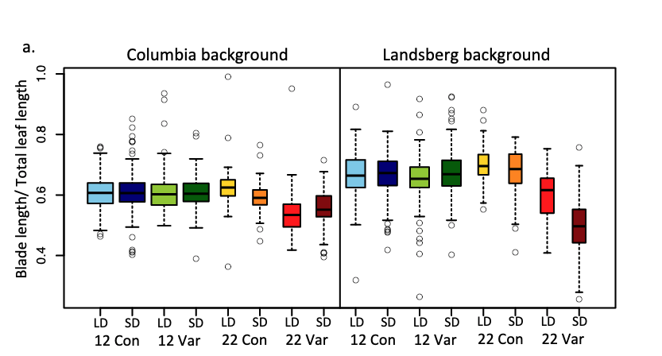

```{r setup, include=FALSE}
knitr::opts_chunk$set(echo = TRUE)
```

[Retour à la page d'accueil](https://scortijo.github.io/2024_L3_R/)

<br>

Dans cette partie du cours vous allez apprendre des **restructurations plus complexes des tables dans R**. 
Ces changement sont parfois nécessaire pour mettre les données dans le format adapté au graphique que vous voulez réaliser.


Aujourd’hui nous allons voir comment:

1. Concaténer ou séparer des colonnes  

2. Passer d'un format large à un format long  

3. Combiner 2 tableaux en un seul  


<br>

# Mise en place

Tout d'abord, créez un nouveau _script R_ et préparez votre environnement de travail:


```{r}
# Chargez la librairie `tidyverse`

# Changez votre répertoire de travail pour être dans `session4_reorganisation_suite`

# Importer `burghardt_et_al_2015_expt1.txt` et mettez le dans un objet appelé `expt1`

```


```{r,  eval = TRUE,message=FALSE, echo=FALSE}
# Chargez la librairie `tidyverse` (aide: utilisez la fonction `library()`)
library(tidyverse)

# Importer `burghardt_et_al_2015_expt1.txt` et mettez le dans un objet appelé `expt1`
#(aide: utilisez la fonction `read_tsv()`)

expt1 <- read_tsv("../data/burghardt_et_al_2015_expt1.txt")

```

<br>


# Concaténer ou séparer des colonnes avec `unite()` et `separate()`

<br>

Pour concaténer deux ou plusieurs colonnes ensemble, utilisez la fonction `unite()`. Par exemple, pour concaténer `vernalization`, `survival.bolt` et `bolt`:


```{r}
# Créez deux nouvelles colonnes
expt1.concatenated <- unite(expt1, "Vern_survival_bolt",vernalization,bolt.survival,bolt)

# Vérifier que la nouvelles colonnes sont bien là
colnames(expt1.concatenated)
```


A contrario, pour séparer une colonne en deux ou plusieurs colonnes, utilisez la fonction `separate()`. Par exemple, pour séparer la colonne `barkground` :


```{r warning=FALSE}
# Créez deux nouvelles colonnes
expt1.separated <- separate(expt1, background, into=c("genotype_background", "FRI_mutation"))

# Vérifier que la nouvelles colonnes sont bien là
colnames(expt1.separated)
```


<br>

-------


> **Exercice 1:** 
> 
> Reproduisez cette figure de [Burghard et al 2015](https://nph.onlinelibrary.wiley.com/doi/full/10.1111/nph.13799)
> 
> 
> 
> 
> Aide: 
> 
> - Créez une nouvelle colonne (blade.ratio) avec le ratio de `blade.length.mm` et `total.leaf.length.mm`
> 
> - Créez une nouvelle colonne (nommée par exemple `condition`) en concaténant `day.length`, `temperature` et `fluctuation`
> 
> - Sélectionnez les background  `Col ` et `Ler`
> 
> - Faites un boxplot du ratio de `blade.length.mm` et `total.leaf.length.mm` en fonction de la `condition`, en créant des facets en fonction du background
> 
> - Pas besoin de mettre de la couleur qui n'apporte rien au graphique
>
> - N'essayez pas de reproduire l'ordre des conditions (sur l'axe x). Nous verrons comment le faire à la prochaine séance

>
> **BONUS**: Ce bonus vous permettra d'avoir des valeurs de x plus proches du graphique
>
> - Avant de créer la nouvelle colonne en concaténant `day.length`, `temperature` et `fluctuation`, créer une colonne `LD.SD` dans laquelle vous aurez "LD" à la place de la valeur "16" de la colonne `day.length`, et "SD" à la place de la valeur "8" de la colonne `day.length`. Utilisez ensuite cette colonne `LD.SD` pour la concaténation avec `temperature` et `fluctuation` pour créer la colonne  `condition`
> - Changez le thème du graphique pour enlever la grille et avoir un fond blanc.

<br>


# Reformater des données avec `pivot_longer()` et `pivot_wider()`

<br>


### Passer au format long avec `pivot_longer()` 

<br>

Imaginons que nous souhaitons faire un boxplot pour le `days.to.bolt` et le `days.to.flower`. 


```{r,  eval = TRUE,message=FALSE, echo=FALSE, warning=FALSE}
pivot_longer(expt1, names_to = "trait", values_to = "time.in.days", cols=c(days.to.bolt, days.to.flower)) %>% 
  ggplot(aes(x=trait, y=time.in.days, color=genotype)) +
  geom_boxplot()
```

<br>

Pour faire ce boxplot il nous faut réorganiser le tableau pour avoir les données pour ces deux mesures dans la même colonnes (`trait`) et une colonne indiquant s'il s'agit de la mesure de `days.to.bolt` ou `days.to.flower` (`time.in.days`). 

<br>

Pour cela nous utilisons la fonction `pivot_longer()` qui permet de passer d'un format "wide" (large) à un format "long".


<br>

Dans ce cas, le nom des colonnes sélectionnées servent à remplir les catégories dans la première colonne crée (en violet dans l'illustration). Et les valeurs de toutes ces colonnes sélectionnées vont remplir la deuxième colonne crée (en bleu dans l'illustration).

<br>


`pivot_longer()` à besoin de trois informations:  

- le nom de la nouvelle colonne contenant les catégories prises à parttir du nom des vieilles colonnes (dans notre cas `trait`) : _names_to_ 

- le nom de la nouvelle colonne contenant les valeurs des anciennes colonnes (dans notre cas `time.in.days`) : _values_to_

- le nom des anciennes colonnes que l'ont veut rassembler : _cols_

Voici comment restructurer notre tableau avec `pivot_longer()`:

```{r}
expt1_long <- pivot_longer(expt1, names_to = "trait", values_to = "time.in.days", cols=c(days.to.bolt, days.to.flower))
```

Nous pouvons maintenant faire notre boxplot


```{r}
ggplot(expt1_long, aes(x=trait, y=time.in.days, color=genotype)) +
  geom_boxplot()
```

<br>

Afin d'exporter ce graphique et de le sauver, nous utilisons la fonction `ggsave()`:


```{r}
ggplot(expt1_long, aes(x=trait, y=time.in.days, color=genotype)) +
  geom_boxplot()

ggsave("boxplot_daystobolt_daystoflower_genotypes.pdf")
```

<br>

> **Exercice 2:** 
> 
> 1. Utilisez la fonction `pivot_longer()` pour restructurer le tableau afin de faire un boxplot de `blade.length.mm` et `total.leaf.length.mm`, coloré par  `fluctuation`.

> 2. Ajoutez aux boxplots des encoches indiquant l'étendue de l'intervalle de confiance à 95% de la médiane (voir l'option `notch` dans `geom_boxplot`). Si les encoches sont étroite, il y a peu d'incertitude sur la médiane, si les encoches sont large, il y a une forte incertitude sur la médiane. Si les encoches de boxplots que nous comparons se chevauchent, alors nous ne pouvons pas conclure à une différence de médiane entre les médiane des deux groupes.  

> 3. Interprétez le graphique: Y a t'il un effet de la fluctuation de température sur la longueur de blade ou de la feuille? Pourquoi?

>
> **BONUS**
> Optimisez le graphique obtenu en jouant sur le thème, les couleurs utilisée (visibles par des daltoniens), le titre et la valeur des axes et de la légende, de manière à avoir un graphique similaire au graphique suivant:


```{r,  eval = TRUE,message=FALSE, echo=FALSE, warning=FALSE}

pivot_longer(expt1, names_to = "trait", values_to = "length.mm", cols=c(blade.length.mm, total.leaf.length.mm)) %>% 
  ggplot(aes(x=trait, y=length.mm, fill=fluctuation)) +
  geom_boxplot(notch=TRUE) +
  scale_fill_brewer(palette = "Set2", labels = c("Con"="Constant", "Var"="Variable"), 
                    name="Fluctuation type") +
  theme_bw() +
  scale_x_discrete(name="",labels=c("blade.length.mm"="Blade","total.leaf.length.mm"="Total leaf")) +
  ylab("Length (mm)")


```

<br>


## Passer au format large avec `pivot_wider()`  ATTENTION, CETTE PARTIE NE SERA PAS VUE EN COURS FAUTE DE TEMPS MAIS VOUS ETES TRES FORTEMENT RECOMMANDE DE LA TRAVAILLER PAR VOUS MEME!!

Parfois, le format de vos données ne vous permet pas de faire l'analyse ou le graphique que vous voulez.

Par exemple, essayons de reproduire le graphique suivant extrait de [Burghard et al 2015](https://nph.onlinelibrary.wiley.com/doi/full/10.1111/nph.13799)

 

<br>

Pour faire cette figure il nous faut une colonne avec le temps de floraison pour les plantes en conditions constante et une autre colonne avec le temps de floraison pour les plantes en condition variable. 
Le temps de floraison pour toutes les plantes sont dans la même colonne dans notre tableau. Par contre, l'information sur le type de traitement (variable ou constant) est dans une autre colonne. Ce n'est pas ce que nous voulons! 
Heureusement, nous pouvons utiliser la fonction `pivot_wider()` pour reformater notre tableau.


Pour y voir plus clair, ne gardons que les colonnes qui vont nous être utiles à la création du tableau:


```{r}

expt1_subset <- select(expt1, plant_nb:vernalization, days.to.bolt)


```

Maintenant nous devons changer la structure de la table pour avoir une colonne avec le temps de floraison pour les plantes en conditions constante et une autre colonne avec le temps de floraison pour les plantes en condition variable. Un peu comme dans le schéma ci-dessous (pour aller du format "long" au format "wide").


<br>

La fonction `spread()` a besoin de deux informations:

- Le nom de la colonne qui va permettre de créer les noms de colonnes dans la nouvelle table. Dans notre cas `fluctuation` : _names_from_

- Le nom de la colonne qui contient les valeurs qui vont remplir les nouvelles colonnes. Dans notre cas `days.to.bolt` : _values_from_


Voici comment restructurer notre tableau avec `pivot_wider()`:


```{r}

expt1_wide <- pivot_wider(expt1_subset, names_from =fluctuation,  values_from =  days.to.bolt)


```

Afin de pouvoir reproduire les couleurs du graphique, nous devons concaténer les colonnes `temperature` et `day.length`.
Et nous pouvons enfin faire le graphique:


```{r}

unite(expt1_wide, "treatment", temperature, day.length) %>% 
ggplot(aes(x=Con, y=Var, col=treatment, shape=treatment)) +
  geom_point()


```

Comme vous avez vu, changer la structure du tableau nous a permis de faire un graphique que nous n'aurions pas pu faire autrement. Cela peut aussi permettre de faire des analyses supplémentaires.

<br>

<br>

<br>


# Combiner plusieurs tableaux en un (`*_join()`)

Quand nous analysons des données, il n'est pas rare que nous ayons plusieurs tableaux contenant des informations de différents types mais qui sont liées les unes aux autres. Afin de répondre à certaines questions, nous devons parfois combiner ces différents tableau en un seul, à l'aide d'une certaine colonne. 

Pour cela nous pouvons utiliser une des fonction de la famille `*_join`.

Toutes ces fonctions ont besoin de trois choses:
- Le nom du premier tableau (celui de gauche)
- Le nom du second tableau (celui de droite)
- Le nom de la colonne qui est utilisée pour combiner les tableaux ensemble (il est aussi possible d'utiliser plus d'une colonne)


Afin de comprendre comment ces fonctions marchent, nous allons utiliser deux jeux de données qui sont déjà présent dans R:

- `band_members` 
```{r}
band_members
```
- `band_instruments`
```{r}
band_instruments
```


La fonction `full_join()`, permet de garder toutes les lignes et toutes les colonnes des deux tableaux dans le nouveau tableau créé en les combinant. Dans notre cas, pour avoir toutes les information sur le groupe de musique et l'instrument pour chaque musicien, nous utilisons:


```{r full_join2}
full_join(band_members, band_instruments, by="name")
```

Vous pouvez voir que quand le groupe de musique ou l'instrument d'un musicien est manquante, un 'NA' est utilisé à la place.


Regardons les autres fonctions de la famille `*_join()`


- Pour garder les données uniquement pour les musiciens présents dans ``band_members`` (table de gauche dans la fonction), nous utilisons `left_join()`:


```{r}
left_join(band_members, band_instruments, by="name")
```

- Pour garder les données uniquement pour les musiciens présents dans ``band_instruments`` (table de droite dans la fonction), nous utilisons `right_join()`:

```{r,}
right_join(band_instruments, band_members, by="name")
```

- Pour garder uniquement les musiciens qui sont les deux tableaux, nous utilisons `inner_join()`:

```{r}
inner_join(band_members, band_instruments, by="name")
```
Dans ce cas il n'y a pas de 'NA'


Ces fonctions peuvent être utiles pour comparer de gros jeux de données :

- `inner_join()` est l'équivalent de _l'intersection_ entre deux jeux de données.

- `full_join()` est l'équivalent de  _l'union_ de deux jeux de données.

<br>


<br>

## Ressources et liens utiles:

- [antisèche pour la réorganisation de données](https://www.rstudio.com/wp-content/uploads/2015/02/data-wrangling-cheatsheet.pdf)
- [Chapitre sur la réorganisation de données du livre 'R for Data Science'](http://r4ds.had.co.nz/transform.html)


<br>


******


[Retour à la page d'accueil](https://scortijo.github.io/2024_L3_R/)


