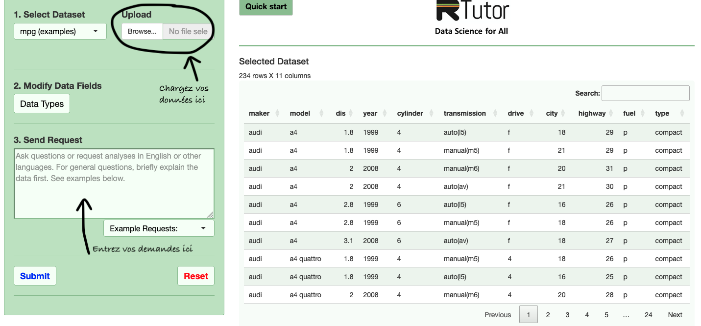

```{r setup, include=FALSE}
knitr::opts_chunk$set(echo = TRUE)
```


[Retour à la page d'accueil](https://scortijo.github.io/2024_L3_R/)

******

Dans cette séance nous allons voir comment utiliser les outils d'intelligence artificielle générative pour aider à l'apprentissage au codage


```{r,  eval = TRUE,message=FALSE, echo=FALSE}
# Chargez la librairie `tidyverse` (aide: utilisez la fonction `library()`)
library(tidyverse)
library(ggpubr)

# Importer `burghardt_et_al_2015_expt1.txt` et mettez le dans un objet appelé `expt1`
#(aide: utilisez la fonction `read_tsv()`)

expt1 <- read_tsv("../data/burghardt_et_al_2015_expt1.txt")

```


# Les IA peuvent donner des réponses fausses

<br>

**ChatGPT va toujours donner une réponse, même si elle est fausse.** Il est difficile de faire la différence entre une réponse juste ou fausse car ChatGPT va répondre dans les deux cas en ayant l'air sûr de lui. Il peut même donner de fausses réferences quand on lui demande.  

Une étude a montré que ChatGPT donne [52% de mauvaises réponses](https://intelligence-artificielle.developpez.com/actu/347064/Une-etude-affirme-que-52-pourcent-des-reponses-de-ChatGPT-aux-questions-de-codage-informatique-sont-incorrectes-et-77-pourcent-sont-verbeuses-mais-les-reponses-du-chatbot-sont-convaincantes/) à des questions de codage. Il va généralement aller dans le sens de l'utilisateur, [quite à se contredire](https://oclock.io/pourquoi-on-deconseille-aux-jeunes-developpeurs-dutiliser-chatgpt) si l'on remet en cause sa réponse.

**Il est donc important de vérifier les réponses de ChatGPT!**

Ci-dessous nous allons voir quelques manières d'utiliser ChatGPT pour nous aider au codage.

<br>

# Compréhension d'un code

## Explication d'un code

<br>

Un bon moyen d'utiliser ChatGPT est pour expliquer un code que nous avons trouvé. Il peut arriver de trouver lors d'une recherche en ligne un code qui semble répondre à notre question mais de ne pas tout comprendre.

Comme exemple, prenons la solution d'un des exercices bonus de notre cours.  
La question de l'exercice était:  
**Filtrez les données pour garder les lignes pour lesquelles le background contient Col**  

Et la réponse était (plusieurs réponses sont possibles):  
```{r,eval=FALSE}
expt1_col_background <- filter(expt1, grepl("Col", background))
```

> Connectez vous maintenant à ChatGPT et demandez lui d'expliquer cette ligne de code. Je vous conseille d'être poli avec ChatGPT (bonjour, s'il vous plait, merci...), [il sera plus efficace](https://www.journaldugeek.com/2024/02/28/ia-soyez-gentil-avec-chatgpt-et-il-vous-le-rendra-bien/).

> Que pensez vous du résultat? Si besoin demandez lui d'expliquer plus en détail certaines parties du code ou de donner un résultat plus concis

<br>

## Ajout de commentaire pour chaque ligne de code

<br>

Afin de pouvoir réutiliser nos codes (et les comprendre plusieurs mois plus tard), il est important de les commenter. ChatGPT peut nous aider à cette tache.

Prenons comme exemple un code plus long venant d'un autre exercice de ce cours.

La question de l'exercice était:  
**Faites un voilin plot de `total.leaf.length.mm` pour chaque génotype et ajoutez la médiane pour chaque groupe (avec un point coloré) ainsi que le nombre d'observation de chaque groupe**

Le code était:
```{r,eval=FALSE}
group_by(expt1, genotype) %>% 
  summarise( mediane.total.leaf.length.mm=median(total.leaf.length.mm, na.rm = TRUE),
            n.obs=n()) %>% 
  mutate(n.obs=paste("n =",n.obs)) %>% 
  full_join(expt1, by="genotype") %>%
  ggplot(aes(x=genotype, y=total.leaf.length.mm)) +
  geom_violin() +
  geom_point(aes(x=genotype, y=mediane.total.leaf.length.mm), col="red") +
  geom_text(aes(label=n.obs, x=genotype, y=0))
```


> Demandez à ChatGPT un commentaire de chaque ligne à intégrer à votre code.   

> Comparez les résultats (et la demande faite à ChatGPT) avec vos camarades. Quel semble être un bon moyen de demander des commentaires du code?


<br>

# Obtention d'un code à partir d'une question

### Un cas simple

<br>

Demandons à ChatGPT de trouver le code pour un des exercices du cours.   
Voici la consigne de l'exercice:  

**Sélectionnez les colonnes dont le titre finit par “bolt”**


> Quel code optenez-vous? Est-ce que cela corresponds à la solution du cours et aux fonctions que nous avons vu en cours?

Pour rappel, voici la solution proposée en cours, faisant appel à une des fonctions que nous avons vu:

```{r,eval=FALSE}
select(expt1, ends_with("bolt"))
```


> Essayez de modifier votre demande à ChatGPT en précisant que vous voulez utilisez tidyverse. 

> Est-ce que la réponse ressemble plus à ce que nous avons vu en cours?

<br>


### Une demande plus complexe

<br>


Voyons maintenant une demande plus complexe. Voici une des questions de l'exam de l'année dernière 

**Faites une figure représentant la distribution de la teneur en azote et en fer en fonction des conditions dans lesquelles les plantes ont poussé. Ajoutez le résultat d’un test statistique comparant les moyennes des différents groupes.**

**Aide : Pour cela, selectionnez les colonnes qui contiennent les informations sur les traitements effectués ainsi que celles avec la mesure de la teneur en azote (N) et en fer (Fe). Modifier le format du tableau pour passer au format long avec une colonne contenant le nom du minéral mesuré (N ou Fe) et une colonne contenant les teneurs dans les plantes pour ces minéraux. Puis, réalisez le graphique demandé de la teneur en azote et en fer en fonction du type de traitement en nitrate. Nous souhaitons une représentation en boxplots colorés suivant la concentration en CO2 atmosphérique, et avec le mineral mesuré (N ou Fe) ainsi que le type de traitement en fer en facet. Pour finir ajoutez au graphique un test de comparaison de moyennes.**


La solution est:
```{r,eval=FALSE}
select(minerals, CO2_treatment, Nitrate_treatment, Iron_treatment, Fe, N) %>% 
pivot_longer(cols=c("Fe","N"), names_to = "metal", values_to = "concentration") %>% 
  ggplot(aes(x= Nitrate_treatment   , y=concentration, fill=CO2_treatment))+
  geom_boxplot()+
  stat_compare_means(label = "p.format", method="t.test", label.y.npc = "bottom") +
  facet_wrap(metal~Iron_treatment, scale="free")
```


> Demandez à ChatGPT de générer le code pour répondre à cette question sans include l'aide. 

> Est-ce que le code de ChatGPT est similaire à la réponse attendue?

<br>

> Essayez de nouveau, cette fois en utilisant l'aide.

> Est-ce que le code de ChatGPT est similaire à la réponse attendue?

> A votre avis pourquoi ChatGPT trouve la réponse dans le deuxième cas et pas dans le premier?

<br>

## Passer de la question biologique au code

<br>

Afin d'utiliser ChatGPT pour générer efficement un code gardez les 3 principes suivant en tête: 

Principe 1: **Soyez specifique**. ChatGPT ne peut pas lire vos pensées  
Principe 2: **Pensez au contexte** (nom des variable, ce que vous avez demandé avant etc)  
Principe 3: **Découpez une opération complexe en plusieurs étapes**  

Aussi gardez en tête que ChatGPT ne donnera par forcement la même réponse à la même demande.

<br>

### Premier exemple.

<br>

Nous voulons effectuer le graphique suivant pour comparer le nombre de feuilles de rosettes et de feuilles caulines:
```{r, warning=FALSE, echo=FALSE}
ggplot(expt1, aes(x=rosette.leaf.num, y=cauline.leaf.num)) +
  geom_point() +
  stat_cor()
```

> Demandez à ChatGPT de générer un code pour comparer le nombre de feuilles de rosette et de feuilles caulines

> Est-ce que vous obtenez le résultat attendu?

> Retravaillez votre demande de manière à ce qu'elle soit plus spécifique et contienne le nom de vos variable afin de pouvoir utiliser le résultat directement.

<br>

### Deuxième exemple 

<br>


Imaginons que nous voulons maintenant faire un graphiqe pour étudier l'effet de la fluctuation en température sur le ratio du nombre de feuilles de rosette et de feuilles cauline et ce uniquement pour les plantes vernalisées, en excluant le génotype vin3-4 FRI. Nous voulons un graphique pour chaque température et durée de jour.

> Demandez à ChatGPT le code pour obtenir le graphique ci-dessous. N'oubliez pas d'être précis et de décortiquer les différentes étapes.   
> Pour vous aider à réfléchir aux différentes étapes, voici le code permettant de répondre à cette question.


```{r, warning=FALSE}
mutate(expt1, ratio_leaves=rosette.leaf.num/cauline.leaf.num) %>% 
  filter(vernalization=="V", genotype!="vin3-4 FRI") %>% 
  ggplot(aes(x=genotype, y=ratio_leaves, col=fluctuation)) +
  geom_boxplot() +
  facet_grid(temperature~day.length) +
  stat_compare_means(label = "p.signif")
```

<br>

### Troisième exemple

<br>

> Demandez à ChatGPT de générer un code afin de reproduire le graphique suivant. Pour cela essayez de comprendre à quelle question permet de répondre ce graphique. A partir de là listez les différentes étapes et mettez les dans votre demande. N'oubliez pas d'être précis en utilisant le nom des variables dans la demande.

```{r, echo=FALSE, message=FALSE, warning=FALSE}
filter(expt1, vernalization=="V", temperature==22, genotype!="vin3-4 FRI") %>% 
  ggplot(aes(x=genotype, y=cauline.leaf.num, col=fluctuation)) +
  geom_boxplot() +
  facet_wrap(~day.length) +
  stat_compare_means(label = "p.signif")
  
```

<br>


# Aide pour trouver une erreur dans un code

<br>

Vous pouvez aussi utiliser ChatGPT pour trouver une erreur dans un code.

Demandez à ChatGPT de touver l'erreur dans le code suivant:
```{r, eval=FALSE}
mutate(expt1, ratio_leaves=rosette.leaf.num/cauline.leaf.num) %>% 
  filter(vernalization=="V", genotype!="vin3-4 FRI") %>% 
  ggplot(expt1,aes(x=genotype, y=ratio_leaves, col=fluctuation)) +
  geom_boxplot() +
  facet_grid(temperature~day.length) +
  stat_compare_means(label = "p.signif")
```

> Que pensez vous de la réponse?


Demandez à ChatGPT de touver l'erreur dans le code suivant:
```{r, eval=FALSE}
mutate(expt1, ratio_leaves=Rosette.leaf.num/cauline.leaf.num) %>% 
  filter(vernalization=="V", genotype!="vin3-4 FRI") %>% 
  ggplot(aes(x=genotype, y=ratio_leaves, col=fluctuation)) +
  geom_boxplot() +
  facet_grid(temperature~day.length) +
  stat_compare_means(label = "p.signif")
```

> Que pensez vous de la réponse?


**ChatGPT n'a pas accès à vos données, il ne peut donc pas vérifier que les variables sont bien ortographiées.**

<br>


# Un outil combinant ChatGPT à vos données

<br>

Afin de vous aider au codage avec un outil qui combine ChatGPT à vos données vous pouvez utiliser le site [rtutor](https://rtutor.ai/)




####  <span style="color: red;">Attention, tout tableau que vous mettez dans ce site n'est plus confidentiel. Ne l'utilisez pas pour des données sensibles ou non publiées! </span>


> Utilisez Rtutor pour obtenir un code pour les trois exemples au dessous dans le cours.   
> Qu'en pensez vous par rapport à CHatGPT?

<br>


# Autres outils d'IA pour l'aide au codage

<br>


- [Gemini (Google Bard)](https://gemini.google.com/?hl=fr)


- [Github Copilot](https://github.com/features/copilot). Cet outil peut [être utilisé dans Rstudio](https://docs.posit.co/ide/user/ide/guide/tools/copilot.html)


******

[Retour à la page d'accueil](https://scortijo.github.io/2024_L3_R/)

