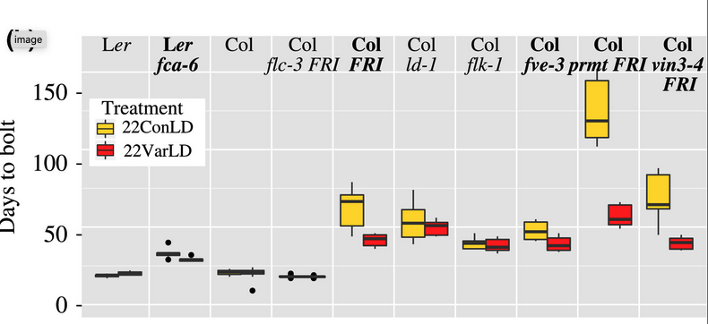

```{r setup, include=FALSE}
knitr::opts_chunk$set(echo = TRUE)
```

[Retour à la page d'accueil](https://scortijo.github.io/2024_L3_R/)

<br>


Aujourd’hui nous allons voir comment:

1. Extraire les statistiques descriptives avec `group_by()` et `summarise()`  

2. Ajouter ces statistiques descriptives à un graphique  


# Mise en place

Avant de rentrer dans le vif du sujet il nous faut mettre en place notre environnement de travail. Créez un nouveau script R et:


```{r}
# Chargez la librairie `tidyverse`

# changer votre répertoire de travail pour être dans le repertoire de la session 5

# Importer `burghardt_et_al_2015_expt1.txt` et mettez le dans un objet appelé `expt1`

```


```{r,  eval = TRUE,message=FALSE, echo=FALSE}
# Chargez la librairie `tidyverse` (aide: utilisez la fonction `library()`)
library(tidyverse)

# Importer `burghardt_et_al_2015_expt1.txt` et mettez le dans un objet appelé `expt1`
#(aide: utilisez la fonction `read_tsv()`)

expt1 <- read_tsv("../data/burghardt_et_al_2015_expt1.txt")

```

<br>

Nous sommes maintenant prêt!

<br>


# Extraire les statistiques descriptives avec `group_by()` et `summarise()`


Parfois nous voulons résumer nos données dans une table plus petite et en extraire des statistiques descriptives (moyenne, médiane, nombre d'observations ...).

Ce type d'opération peut être fait avec la combinaison de deux fonctions: `group_by()` et `summarise()`.

Notez que `group_by()` ne change pas le format de la table de données. Cette fonction liste des lignes qui doivent être groupées. Nous pouvons ensuite utiliser `summarise()` pour extraire des statistiques descriptives de chaque groupe.


Par exemple, nous pouvons extraire la moyenne pour le temps de floraison de chaque génotype:  

```{r}

group_by(expt1, genotype) %>% 
summarise(mean.days.to.flower = mean(days.to.flower, na.rm = TRUE))

```

L'output contient deux colonnes:

- `genotype` qui est la colonne qui a servi à grouper les données

- `mean.days.to.flower` qui est la colonne crée par la fonction `summarise`

Il n'y a que 10 lignes dans cette table, une par génotype.


Il est possible de grouper les données par plus d'une variable.

Par exemple nous pouvons mesurer la moyenne, la médiane et l'écart type pour chaque génotype aux différentes températures:


```{r}

group_by(expt1, genotype, temperature) %>% 
summarise(mean.days.flower = mean(days.to.flower, na.rm = TRUE),
          sd.days.flower = sd(days.to.flower, na.rm = TRUE),
          median.days.flower = median(days.to.flower, na.rm = TRUE))
```

Il y a maintenant 20 lignes dans la table, car chaque génotype apparaît deux fois (12 et 22 degrés)


Une autre information utile que nous pouvons extraire est le nombre d'observation pour chaque groupe. Pour cela nous devons utiliser la fonction `n()`, dans `summarise()`  qui compte le nombre de ligne pour chaque groupe.

Par exemple, pour connaitre le nombre d'observations pour chaque génotype:


```{r}

group_by(expt1, genotype) %>% 
summarise(n.obs = n())
```

Attention, `n()` ne peut être utilisé que dans la fonction `summarise()`. 


**Attention:** Quand vous utilisez la fonction `group_by()`, les lignes du tableau restent groupées en fonction de la variable utilisée. Les opérations suivantes vont utiliser ces groupes, ce qui peut poser problème. Pensez à utiliser la fonction `ungroup()` pour enlever les groupes quand vous avez fini avec `group_by()` et `summarise()`


> **Exercice 1:**
>
> Calculez la médiane et l'écart-type de `blade.length.mm` et `total.leaf.length.mm` pour chaque `genotype` aux différentes `day.length`. Ajoutez aussi le nombre d'observations de chaque groupe 
>
>

> **BONUS**   
> Calculez chaque `genotype` en fonction de s'ils ont subit ou non une `vernalization`:
> La moyenne du ratio de `blade.length.mm` et `total.leaf.length.mm`   
> Le nombre d'observation de chaque groupe   
> Modifiez la colonne qui contient le nombre d'observations de manière à ajouter "n=" devant la valeur du nombre d'observations


<br>

# Insérer les statistiques descriptives à un graphique

Une autre possibilité est d'ajouter les statistiques descriptives à un graphique contenant les données.

Pour cela, nous devons:

- Utiliser `group_by()` et `summarise()` pour extraire les statistiques descriptives

- Utiliser une fonction de la famille `*_join()` pour les combiner avec nos données

- Nous pouvons maintenant faire un graphique contenant les données et les statistiques descriptives.

Par exemple, prenons ce boxplot:


```{r}

  ggplot( expt1, aes(genotype, rosette.leaf.num)) +
  geom_boxplot()
```


Si nous voulons y ajouter le nombre d'observations pour chaque groupe, nous utilisons le script suivant:

```{r}

group_by(expt1, genotype) %>% 
  summarise(n.obs=n()) %>% 
  mutate(n.obs=paste("n =",n.obs)) %>% 
  inner_join(expt1, by="genotype") %>% 
  ggplot( aes(genotype, rosette.leaf.num)) +
  geom_boxplot() +
  geom_text(aes(label=n.obs, x=genotype, y=0))
```

<br>

> **Exercice 2**
>
> Faites un voilin plot de `total.leaf.length.mm` pour chaque génotype et ajoutez la médiane pour chaque groupe (avec un point coloré) ainsi que le nombre d'observation de chaque groupe
>
>
> Exportez et sauvez le graphique obtenu au format `jpg`


> **BONUS**
> Lisez la partie du cours sur les facteurs (que nous n'aurons pas le temps de traiter) et faites l'exercice 3.

<br>

Avec cette même méthode il est aussi possible d'ajouter des informations pour des groupes formés à partir de deux variables.

Par exemple, si nous voulons faire un boxplot `rosette.leaf.num` pour chaque génotype en fonction de la température et y ajouter le nombre d'observations des différents groupes, nous utilisons le script suivant:


```{r}

group_by(expt1, genotype, fluctuation) %>% 
  summarise(n.obs=n()) %>% 
  mutate(n.obs=paste("n =",n.obs)) %>% 
  inner_join(expt1, by=c("genotype", "fluctuation")) %>% 
  ggplot( aes(genotype, rosette.leaf.num, fill=fluctuation)) +
  geom_boxplot() +
  geom_text(aes(label=n.obs, x=genotype, y=-2),position=position_dodge(0.8), angle=45)
```


<br>


## Changer l'ordre des catégories dans un graphique en utilisant des `facteurs`

Par défaut, les catégories dans un graphique sont ordonnées alphabétiquement. Bien souvent ce n'est pas l'ordre que nous voulons.

Par exemple, essayons de reproduire le graphique suivant:




```{r}
filter(expt1, temperature==22, day.length==16) %>% 
ggplot(aes(x=genotype, y=days.to.bolt, fill=fluctuation)) +
  geom_boxplot()

```

Les génotypes ne sont pas dans le même ordre car ggplot a utilisé l'ordre alphabétique, même s'ils n'étaient pas dans cet ordre dans le tableau.

Afin de changer l'ordre nous devons utiliser un autre type de variable, les **facteurs**. Les facteurs sont des variables spéciales de type caractère pour lesquels nous pouvons définir des niveaux ( _levels_ ), c'est à dire les modalités prédéfinies de cette variable. Ces niveaux sont les valeurs uniques de la variable auxquelles un ordre peut être attaché.


Nous pouvons convertir une variable en facteurs en utilisant la fonction `factor()`:


```{r}
# Convertissons genotype dans expt1 en facteurs:
factor(expt1$genotype)
```

Nous pouvons voir qu'il y a 10 niveaux, correspondant à chacun des génotypes, et qu'ils sont par ordre alphabétique. 

Nous pouvons spécifier l'ordre des niveaux dans la fonction: 

```{r}
factor(expt1$genotype, levels = c("Ler-1", "fca-6", "Col Ama", "flc-3 FRI", "Col FRI", "ld-1", "flk-1",
                                  "fve-3", "prmt5 FRI","vin3-4 FRI"))
```

Maintenant que nous avons converti la variable ne facteur avec l'ordre des niveaux que nous voulons, nous pouvons l'utiliser pour représenter les variables catégoriques avec l'ordre que nous voulons dans un graphique:


```{r}

mutate(expt1, genotype = factor(genotype, levels = c("Ler-1", "fca-6", "Col Ama", "flc-3 FRI", "Col FRI",
                                                     "ld-1", "flk-1", "fve-3", "prmt5 FRI","vin3-4 FRI"))) %>% 
  filter( temperature==22, day.length==16) %>%
  ggplot(aes(x=genotype, y=days.to.bolt, fill=fluctuation)) +
  geom_boxplot()
```

Nous pouvons aussi ordonner les génotypes en fonction de `days.to.bolt`. Pour cela nous utilisons la fonction `fct_reorder()` dans le package `forcats` (qui est inclus dans `tidyverse`)


```{r}

  filter(expt1, temperature==22, day.length==16) %>% 
  mutate( genotype = fct_reorder(genotype, days.to.bolt)) %>% 
  ggplot(aes(x=genotype, y=days.to.bolt, fill=fluctuation)) +
  geom_boxplot()

```


> **Exercice 3**
>
> Représenter des violin plots de `cauline.leaf.num` pour les génotypes de `background` "Col", colorés par la température et ce uniquement pour les plantes sans fluctuation de température et qui sont en jours longs (16 h). 
>
> Ordonnez les génotypes selon ces deux cas (un graphique par cas):
>
> -1 Dans l'ordre suivant: "Col Ama", "ld-1", "fve-3", "flk-1"
>
> -2 Dans l'ordre de la valeur de `cauline.leaf.num`
>


<br>

# Ressources et liens utiles:

- [antisèche pour la réorganisation de données](https://www.rstudio.com/wp-content/uploads/2015/02/data-wrangling-cheatsheet.pdf)
- [Chapitre sur la réorganisation de données ddu livre 'R for Data Science'](http://r4ds.had.co.nz/transform.html)


<br>

******
  
#  <span style="color: blue;">Contrôle continu à faire pour la prochaine séance </span>

#### A partir ce ce que nous avons vu aujourd'hui:

#### - Finissez la deuxième moitié du contrôle continu dont les instructions sont [ici](Devoir_seance6.html)

#### - Déposez avant le 01/12/2024 à minuit sur Moodle le script R de la deuxième moitié du contrôle continu résultant des instructions à la fin des séances 4 et 6.

<br>

La semaine prochaine nous allons faire un examen blanc, vous demandant d'explorer un jeu de donnée. Il s'agira d'une mise en pratique des fonctions que nous avons vu jusqu'ici. 

**Afin de vous y préparer, nous vous recommandons de reprendre l'ensemble des cours et de vous exercer à refaire les exercices (sans avoir recours aux solutions si possible).**

Lors de l'examen blanc (et de l'examen final) vous aurez accès au cours et à vos scripts. Vous allez être évalué sur votre capacité à utiliser les différentes fonctions et à comprendre leur utilité, et non sur de la connaissance pure.


******


[Retour à la page d'accueil](https://scortijo.github.io/2024_L3_R/)


